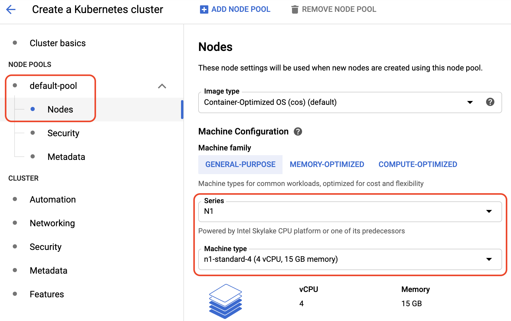
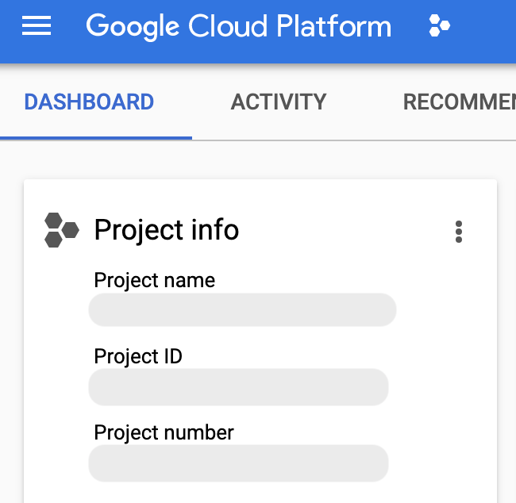

# Setting up Istio-powered Anthos Service Mesh on Google Kubernetes Engine

_A Google Cloud tutorial I wrote in 2020 when learning how to use Istio and Anthos_.

### Contents:

- Introduction
- Overview of Anthos
- Overview of an Anthos Service Mesh
    - Istio service mesh
- Kubernetes and Anthos GKE
- A brief history of containers (covering Borg, CGroups/Process Containers, Docker, and more)
- Start a new Anthos Service Mesh project
- Enable relevant APIs
- Check your IAM permissions
- Provision a new Google Kubernetes Engine cluster
- Create a service account for Istio and authenticate
- Install an Anthos Service Mesh with `istioctl`

## Introduction

This tutorial is designed to give you a broad overview of the Anthos product suite and its major components, such as Anthos Service Mesh, Google Kubernetes Engine (GKE), and Istio for container, cluster, and service monitoring and management with Google Cloud. You will also be learning how to perform a clean installation of an Anthos Service Mesh on a Google Cloud GKE cluster in your project.

Google Cloud's **[Anthos Service Mesh](https://cloud.google.com/service-mesh/docs/overview)** provides operational control and insights over a service mesh—a network of microservices that make up the applications and the interactions between them. It enables users to get a uniform observability into the workloads, so that they can make informed decisions on routing traffic, [security](https://cloud.google.com/service-mesh/docs/security-overview) and encryption policy enforcement, and other rule configurations. 

## Overview of Anthos

<center></center>

With [94%](https://www.bvp.com/assets/media/bessemer-state-of-the-cloud-2020.pdf) of enterprises already using cloud services in some capacity, companies and developers are faced with increasingly more complex tasks of managing on-prem infrastructure with cloud services. Meanwhile, more enterprises and developers are embracing hybrid and multi-cloud models, while modernizing applications and adopting microservices by pulling apart monolithic services.

In 2019, Google Cloud announced a broad product suite called **[Anthos](https://cloud.google.com/anthos/docs/concepts/overview)** to help bridge the worlds of on-prem and cloud-based infrastructure. 

Anthos helps you move applications to the cloud-native world with improved workflow management and reduced operational complexity. You can move workloads from on-prem to the cloud and manage the infrastructure with a consistent set of policies and tools.

For each of Google Cloud's fully-managed solutions, such as Google Kubernetes Engine (GKE) and Istio on GKE, Anthos has equivalent platforms for the on-prem, multi-cloud, and hybrid cloud world:

| Fully-managed by Google Cloud   | For on-prem, multi-cloud, hybrid cloud |
| ------------------------------- | -------------------------------------- |
| Kubernetes Engine (GKE)         | Anthos GKE (On-Prem, for AWS/Azure)     |
| Istio on GKE                    | Anthos Service Mesh                    |

Anthos GKE and Anthos Service Mesh are built on open-source and widely-adopted technologies led by Google and its partners, namely: **[Kubernetes](https://kubernetes.io)** and **[Istio](https://istio.io)**

These technologies provide solutions for modern infrastructure and application development challenges by:

- Decoupling of applications for modularity > with Kubernetes and Istio.
- Providing scalable configuration management > with Istio.

Anthos offers a structured view of various resources, including clusters, services, and workloads. And, since it is a software-based platform, the infrastructure is abstracted away, so that you can focus more on applications and less on management.

## Overview of an Anthos Service Mesh

An Anthos Service Mesh is a network for services that manages interactions across all services. It uses a distribution of [Istio](https://istio.io/)—an open-source implementation of the service mesh infrastructure layer. 

### Istio service mesh

Istio helps configure and manage various applications and services as the mesh network scales. With Istio's mesh service platform, you can:

- Uniformly observe all their workloads and obtain automatic metrics, logs, and traces for all traffic within clusters.
- Insulate application-level code from the backends by decoupling access control systems, telemetry capturing systems, quota enforcement systems from the backends’ specific interfaces—all of that while being able to inject and control policies between application code and backend.
- Easily manage network traffic routing and splitting for microservices through decoupling traffic flow and infrastructure scaling.
- Automatically load balance for various traffic types (HTTP, gRPC, WebSocket, and TCP).
- Enforce security and encryption policy without changing applications themselves.

An Istio service mesh is logically split into a **Data Plane** and a **Control Plane**.

- The **Data Plane** has a set of proxies—**Envoys**—deployed as **sidecars**. They _mediate and control network communication between microservices_ along with **istiod** (previously, Galley and Mixer). You can deploy Envoy proxies to each Kubernetes pod to work alongside the applications. In return, you don't need to load additional libraries or make changes to your applications, as they manage client-side load balancing, circuit breakers, logging, mTLS, etc.

- The **Control Plane** takes care of _configuring and managing of the Envoy proxies to route traffic_. 

Originally, the Control Plane was made up of three major elements: 

- Istio **[Pilot](https://istio.io/pt-br/docs/reference/commands/pilot-agent/)** communicates with the proxies and deploys routing and configuration rules.
- Istio **[Galley](https://istio.io/pt-br/docs/reference/commands/galley/)** takes care of telemetry, such as logs. (Note: this part used to be called **Mixer**).
- Istio **[Citadel](https://istio.io/pt-br/docs/tasks/security/citadel-config/)** is the security center that takes care of certificates for the proxies in the entire Istio network mesh.

Starting from v1.5 as of Q1 2020, the Istio components in the Control Plane were [consolidated](https://istio.io/docs/ops/deployment/architecture/) into **`istiod`**.

**`istiod`** unified Pilot, Galley, Citadel and the Envoy sidecar injector functionalities into a single binary. Installation became easier with fewer required Kubernetes deployments and associated configurations. Many of the configuration options are no longer needed. Things, such as VM usage, maintenance of dependencies, and scalability (with just one component versus several) became easier too.

> **Note**: In addition to being part of Anthos Service Mesh, Istio is also available as **[Istio on GKE](https://cloud.google.com/istio/docs/istio-on-gke/overview)** (a tool that provides automated installation and upgrade of Istio by running in GKE clusters).
> 
> Another key component of Anthos is **[Anthos Config Management](https://cloud.google.com/anthos-config-management/docs)** designed for automation of security and policy at scale. It allows to create a common configuration, including custom policies, and sync it across all Kubernetes clusters. With Anthos Config Management you get _policy as code_ thanks to the use of Git, YAML, and JSON.
> 
> In addition, Anthos uses the **[Operations Suite](https://cloud.google.com/stackdriver/docs)** (formerly, **Stackdriver**), which provides an overview of logs and telemetries sent by Istio and allows you see logs across all services. It also allows application debugging and incident management.

## Kubernetes and Anthos GKE

The Anthos platform suite uses [GKE](https://cloud.google.com/kubernetes-engine/docs) as its main computing environment, powered by [Kubernetes](https://kubernetes.io) for running and managing containers at scale [on-prem](https://cloud.google.com/anthos/gke/docs/on-prem) and with other cloud services.

Kubernetes provides container orchestration for better application management by:

- Having one master stateless server API instead of many APIs used for different tasks.
- Simplifying operations through container packaging, so that you can scale applications without scaling operations.
- Decoupling every piece of applications and systems for modularity and flexibility:
    - Pods serve as atomic units of clusters in K8s and they act as modular and composable building blocks that help build distributed systems. Each pod has its own IP address and a set of pods—a DNS name, which can be load-balanced.
- Having names for processes for simpler discovery (for example, for networks or IPCs).
- Having labels, which are key-value pairs (such as role "frontend", stage "production") that you can query against to help with organization and discovery.
- Using consistent and coherent patterns and ideas of system behaviors.

> **Note:** Google Cloud has been offering a hosted version of Kubernetes called **[Google Kubernetes Engine (GKE)](https://cloud.google.com/kubernetes-engine/docs)** since 2015. A Kubernetes Engine cluster consists of a Kubernetes master API server hosted by Google and a set of worker nodes. The worker nodes are Google Cloud [Compute Engine VMs](https://cloud.google.com/compute/docs/containers).
> 
> To interact with the Anthos GKE for On-Prem clusters from the Google Cloud Console, you can use **GKE Hub**—a centralized management tool.
> 
> For workload migration from on-prem VMs, AWS or Azure to containers, Google Cloud has a solution called **[Anthos Migrate](https://cloud.google.com/migrate/anthos/docs)**.

## A brief history of containers    

There is a distinct relationship between how the cloud services came to be—since the VMs started being rolled out in mid-2000s as a service—and the idea of application packaging and resource isolation.

Containers have been helping users separate applications from infrastructure and shorten the cycle between writing and running code. They have allowed monolithic applications inside virtual machines (VMs) to be split into smaller parts and run simultaneously, saving time and possibly a lot of money. With containerization, developers have been able to deploy and update software on the go.

A series of projects—from Google's Borg, CGroups, Docker, Kubernetes, and Knative to Istio—have introduced a number of key features that define modern on-prem and cloud services, namely:

- Immutability of infrastructure.
- Declarative configuration.
- Server-side deployment
- Health maintenance.
- Goal-oriented processes.

### _Borg_

Google has been running its software in containers for many years. In 2003, it began working on automating cluster management with a project titled **[Borg](https://research.google/pubs/pub43438/)**. It was a large scale cluster manager born out of the merger of two systems called **Global Work Queue** (for running batch jobs across many machines, such as MapReduce) and **Babysitter** (for restarting crashed servers).

### _CGroups/Process Containers_

In 2006-2007, engineers at Google started working on an open-source feature for the Linux kernel called **[CGroups](https://en.wikipedia.org/wiki/Cgroups)** (Control Groups, previously known as Process Containers) for resource or group process management. CGroups was originally mainlined into the Linux kernel in 2007.

### _Docker_

<center></center>

The CGroups method of isolation and management of resources has been used in several ways, including through **[Docker](https://docs.docker.com/get-started/)**. Open-sourced in 2013, Docker is a platform for developing, shipping, and running applications. It introduced developer-friendly image distribution infrastructure and container runtime, and tools for image building and formatting.

Docker made it more flexible to manage and run containers by packaging applications and their dependencies into lightweight containers that can be run on-prem, in the cloud, or on VMs.

### _Kubernetes_

<center></center>

Running many containers can be challenging. So, in 2014-2015, Google announced and open-sourced a project called **[Kubernetes (K8s)](https://kubernetes.io/)** for multiple container orchestration, which builds upon the company's experience running production workloads.

Kubernetes allows users to deploy software to many machines in orchestration and run containers at scale. With Kubernetes, applications inside containers can be run anywhere with the tools and resources they need.

Since its launch, Kubernetes has become the de facto standard for running containers.

### Istio 

<center></center>

As application architectures became increasingly based on shared services that are deployed and scaled dynamically on the cloud, there was a need for stronger service identity and authentication. As services are broken into atomic parts, it becomes more challenging to manage them. 

Therefore, in 2017, teams from Google, IBM and Lyft founded a project called **[Istio](https://istio.io/)**. It is an open-source platform for connecting, securing, controlling, and monitoring microservices, while reducing the complexity of managing their deployments. Istio allows developers to deploy site reliability engineering best practices. Version 1.0 of Istio was released in 2018. 

### _Knative_

<center></center>

Kubernetes is a powerful project. And applications that can be run outside of monolithic VMs in a serverless way have many benefits, including on the billing side. So, in 2018, Google brought Kubernetes and serverless together by open-sourcing a project called **[Knative](https://knative.dev/)**.

Knative extends Kubernetes and provides essential components for building source-centric, modern, and container-based software that can run anywhere, while bringing workload portability and the serverless developer experience. Users are able to have both the velocity of application development and flexibility without the lock-in. Knative has received [contributions](https://knative.dev/community/contributing//annual_reports/Knative%202019%20Annual%20Report.pdf) from Pivotal, IBM, and Red Hat, among others, and has had collaborations with the open-source function-as-a-service framework communities, such as OpenWhisk, riff, and Kyma.

> Knative powers Google Cloud's managed cloud-based solution called **[Cloud Run](https://cloud.google.com/run/docs)**. It is also a part of **[Cloud Run for Anthos](https://cloud.google.com/run/docs/gke/setup)**, which is not covered in this tutorial.

## Start a new Anthos Service Mesh project

You have been given an overiew of containers, service mesh and various Anthos technologies on Google Cloud. Now, you will learn how to install an Anthos Service Mesh on a Google Cloud GKE cluster.

Throughout the tutorial, you will be using two tools for managing and interacting with Google Cloud services, namely:

- [_Google Cloud Console_](https://cloud.google.com/docs/overview#ways_to_interact_with_the_services): for interacting with Google Cloud via a graphical user interface in a browser. You can create, manage, and monitor any available Google Cloud services in the Cloud Console.
- [_Google Cloud Shell_](https://cloud.google.com/shell/docs?hl=en): for command line and automation-based interactions with Google Cloud services. The Cloud Shell is a browser-based shell that is both interactive and authenticated. Cloud Shell is a virtual machine loaded with development tools offering a persistent 5GB home directory. You can choose to interact with developer tools (for example, Python), text editors (including vim and nano), and other tools (such as Git and pip).

First, start with creating a new project and giving it a name—a **project ID**. In Google Cloud, a project ID is a customizable unique identifier for your project. 

> A **project ID** must start with a lowercase letter, and can contain only ASCII letters, digits, and hyphens, and must be between six and 30 characters. It is unique and when you choose it or any resource names, please do not include any sensitive information in them. Some words, such as ssl and google, are restricted from use in project IDs.

### In Cloud Console

- Go to the **[Manage Resources](https://console.cloud.google.com/cloud-resource-manager)** page. 

- Select **Create Project**.

<center></center>

- In the **New Project** window, enter a project name. 

    In this example, you'll be using "**myanthosproject**".

- Click **Create**.
    
- Next, go to the **[Dashboard](https://console.cloud.google.com/home)** page, click **Select a project** from a drop-down list at the top of the page, and then click on your new project's name. If you have many projects, you can use the search bar to find it.

### In Cloud Shell

- First, activate the Cloud Shell if you don't have it open in the [Cloud Console](console.cloud.google.com):

- Click the **Activate Cloud Shell** button (**>_**) on the top right toolbar:

<center></center>

- Select **Continue** in a new tab that appears in the bottom half of your browser window. Your Cloud Shell now should be ready.

    > **Optional:** The gcloud interactive shell environment provides a richer `bash` experience with autocomplete and suggestions of text snippets. You can view full documentation [here](https://cloud.google.com/sdk/docs/interactive-gcloud) in order to try it.
    
- To create a new project, use the `gcloud projects create` [command](https://cloud.google.com/sdk/gcloud/reference/projects/create), followed by the project's new ID. You will be using `myanthosproject` in this example:
    
    ```bash
    gcloud projects create myanthosproject
    ```

- Set the variable for your project ID:
    
    ```bash
    export PROJECT_ID=$(gcloud config get-value project)
    ```

- Set the project as your default project by using the `gcloud config set project` [command](https://cloud.google.com/sdk/gcloud/reference/config/set), followed by the project's ID defined in the previous step:
    
    ```bash
    gcloud config set project $PROJECT_ID
    ```

- You will be using another environment variable for the project number, so let's set it by running the following command:
    
    ```bash
    export PROJECT_NUMBER=$(gcloud projects describe ${PROJECT_ID} \
        --format="value(projectNumber)")
    ```
    
    > **Note**: In Google Cloud, a **project number** is an automatically generated unique identifier for your project. 
    >
    > The project number and project ID are unique across Google Cloud.
    
## Enable relevant APIs

Having created a new project, you can now enable all the necessary APIs required to use GKE and Anthos Service Mesh-related services.

Here is a full list of APIs you will be switching on via the Cloud Console or the Cloud Shell:

- **Anthos API**, **Anthos Service Mesh Certificate Authority API**, **Mesh Telemetry API**, **Mesh Configuration API**: Anthos-related APIs for Service Mesh, mesh telemetry, and mesh configuration.
- **GKE Connect API**: for connectivity between your Kubernetes clusters and Google Cloud.
- **GKE Hub**: for centralized management.
- **Google Container Registry API**: for secure and private Docker image storage.
- **Compute Engine API**:  for creating and running VMs on Google Cloud.
- **Cloud Logging API** and **Cloud Monitoring API** (part of the **[Google Cloud operations suite](https://cloud.google.com/stackdriver/docs)** (previously, **Stackdriver API**): for cluster telemetry. 
- **Cloud Trace API** for collecting latency data from your applications.
- **IAM Service Account Credentials API** for creating credentials for IAM service accounts.
- **Cloud Resource Manager API**: provides container resources for grouping and hierarchically organizing other Google Cloud resources.

### In Cloud Console

1. Under the **Navigation Menu**, go to **APIs & Services** > **Library**:

<center></center>

You should be greeted with the "Welcome to the API library" message.

> Note: If you see the **APIs and Services** dashboard, click **Enable APIs and Services**.

2. In the search bar, enter a name of the first API from the list above—"**Anthos API**".

3. Click **Enable**.

<center></center>

You should be greeted with the Anthos API panel. Return back to **Library** and follow steps 1 through 3 until all the necessary APIs from the list above are enabled. Note that your project may have some of the APIs set up already.

### In Cloud Shell

The task of enabling APIs all in one go can be done by running a command line with `gcloud`.

- Use the `gcloud services enable`[command](https://cloud.google.com/sdk/gcloud/reference/services/enable) to enable all the necessary API services at once:

    ```bash
    gcloud services enable \
        anthos.googleapis.com \
        gkeconnect.googleapis.com \
        gkehub.googleapis.com \
        container.googleapis.com \
        compute.googleapis.com \
        cloudtrace.googleapis.com \
        monitoring.googleapis.com \
        logging.googleapis.com \
        meshca.googleapis.com \
        meshtelemetry.googleapis.com \
        meshconfig.googleapis.com \
        iamcredentials.googleapis.com \
        cloudresourcemanager.googleapis.com
    ```
    
    When the process is finished, you should see an output that resembles this:
    ```
    Operation "operations/xxxx.xxxxx-xxxx-xxxx-xxxx-xxxxx" finished successfully.
    ```

## Check your IAM permissions

Your next step is to verify via Cloud IAM that your account has an _**Project Owner**_ role assigned to it. Overall, the goal is to have the Project IAM > Admin, Project > Editor, Kubernetes Engine > Admin, GKE Hub > Admin, Service Account > Admin, Service Account key > Admin. Being a _Project Owner_ grants you these permissions.

> **Note**: Google Cloud's **[Identity and Access Management (IAM)](https://cloud.google.com/iam/docs/granting-changing-revoking-access)** lets you control who (users) has what access (roles) to which resources by setting IAM policies. IAM policies grant specific role(s) to a user giving the user certain permissions. You can read more about Cloud IAM policies [here](https://cloud.google.com/iam/docs/policies).

### In Cloud Console

- Go to **Navigation Menu** > **IAM & Admin** > **IAM**:

<center></center>

- Scroll through the list to find your user account (your Google Cloud-registered email address). 

<center></center>

- If it doesn't say you have the Owner role, click on the pencil icon to edit and amend the role in a new window:

<center></center>

- Click **Save**.

### In Cloud Shell

- Set the user account—your email address associated with the Google Cloud account—as an environment variable:
    
    ```bash
    export USER_ACCOUNT=$(gcloud config get-value core/account)
    ```

- Then, list all Google Cloud IAM policies in the project by using the `gcloud projects get-iam-policy` [command](https://cloud.google.com/sdk/gcloud/reference/projects/get-iam-policy):

    ```bash
    gcloud projects get-iam-policy $PROJECT_ID
    ```
    
    The output may be long. It should show if your account—an email address—is an Owner:
    
    ```
    bindings:
    ...
    - members:
      ...
      - serviceAccount:xxxxx@{PROJECT_ID}.iam.gserviceaccount.com
      - {USER_ACCOUNT}
      role: roles/owner
    ...
    ```
    
- If you are not the _Project Owner_, you should request to an admin to have that role granted to your user account by running the `gcloud projects add-iam-policy-binding` [command](https://cloud.google.com/sdk/gcloud/reference/projects/add-iam-policy-binding) as follows:

    ```bash
    gcloud projects add-iam-policy-binding $PROJECT_ID \
        --member=user:$USER_ACCOUNT --role=roles/owner
    ```

## Provision a new Google Kubernetes Engine cluster

Anthos is powered by Kubernetes. Therefore, before you get Anthos Mesh Service up and running, you need to have a GKE cluster. In this tutorial, you will create and configure a new single-zone cluster with the following specifications:

- **Cluster name**: "mycluster".
- **GKE cluster version**: "1.14.10-gke.36".
- **[Zone](https://cloud.google.com/compute/docs/regions-zones)**: "us-central1-b".
- **[Machine type](https://cloud.google.com/compute/docs/machine-types)**: N1 Standard with 4 vCPU and 15GB memory.
- **Number of nodes**: 4.
- **[Workload Identity (security)](https://cloud.google.com/kubernetes-engine/docs/how-to/workload-identity)**: with "**{PROJECT_ID}.svc.id.goog**" used as a pool ID.

    > **Note**: **[Workload Identity](https://cloud.google.com/kubernetes-engine/docs/how-to/workload-identity)** for the GKE cluster brings improved security properties and manageability. There is only one fixed workload identity pool per a Google Cloud project (`{PROJECT_ID}.svc.id.goog`).
    
- Enable cluster **monitoring and logging** (part of the **[Operations Suite](https://cloud.google.com/stackdriver/docs)** and formerly known as **Stackdriver**).

    > **Note**: GKE includes integration with **Cloud Monitoring** and **Cloud Logging** for monitoring, system management, log debugging, and performance analysis.
    
- The Virtual Private Cloud (VPC) **subnetwork (subnet)** is set to "default".

    > **Note**: In Google Cloud, new projects start with a default [VPC network](https://cloud.google.com/vpc/docs/vpc) (an auto mode VPC network) that has one subnet per each region.
    
- Add a **metrics label for Anthos Mesh Service** with a key-value pair of "**mesh_id**" and "**proj-{PROJECT_NUMBER}**". 

    > **Note**: The label **mesh_id** is required for metrics to be displayed on the **Anthos Service Mesh dashboard**. It follows the `proj-{PROJECT_NUMBER}` format.
    
### In Cloud Console

- Under **Navigation Menu**, go to **Kubernetes Engine** under **Compute** and select **Clusters**:

<center></center>

- Your view may also look like one of the two screenshots below. Click **Create Cluster**:

<center></center>

<center></center>

- You should be greeted with a new version of the **Create a Kubernetes Cluster** panel:

1. Under **Cluster Basics**: 

- Enter the **Name** of your cluster: "**mycluster**".
    
- Set the **Location type** to **Zonal** and choose the "**us-central1-b**" zone.
        
- Check that the GKE cluster **Master version** is set to **Static version**: **1.14.10-gke.36 (default)**.
        
<center></center>

2. In the **Node pools** section:
    
- Under **Node pool details**, enter or change the **Number of nodes** to **4**.

<center></center>

- Click **Nodes** and under **Machine configuration** select **Machine type** and **n1-standard-4 (4 vCPU, 15 GB memory)**.

<center></center>

3. In the **Cluster** section:

- Under **Networking**, check that the subnetwork to which the cluster will belong in the **Node subnet** field is set to **default**.

<center></center>

- Under **Security**, check **Enable Workload Identity** and in the **Select Workload Pool** field enter a workload identity pool name in the format: "{PROJECT_ID}.svc.id.goog". For example, here you'll be using "**myanthosproject.svc.id.goog**".

<center></center>

- Under **Features**, check **Enable Kubernetes Engine Monitoring** (that's also known as Stackdriver for GKE). Select **Legacy Logging and Monitoring** from the drop-down menu and check **Enable Legacy Monitoring service** and **Enable Legacy Logging service**.

<center></center>

- Under **Metadata**, enter "**mesh_id**" and "**proj-{PROJECT_NUMBER}**" for **Key** and **Value** under **Labels**, respectively. Replace "{PROJECT_NUMBER}" with your own number. 

<center></center>

> **Note**: To obtain your **project number** using the Cloud Console, click on the **Navigation Menu** and select **Home**. Then, click on the **Dashboard** page. In the top left corner you should see **Project Info** with your project number and other details:
> 
> <center></center>

4. Click **Create** to finish setting up your Kubernetes cluster.

> **Note**: If you click on **command line** next to **Equivalent** to the right of the **Create** button in the lower part of the panel, you should see a command line-equivalent of all the steps you have taken to create a cluster using the Cloud Console:
>
> ```
> gcloud beta container \
>   --project "{PROJECT_ID}" clusters create "mycluster" \
>   --zone "us-central1-b"  \
>   ... 
>   --cluster-version "1.14.10-gke.36"  \
>   --machine-type "n1-standard-4"  \
>   ... 
>   --num-nodes "4"  \
>   --enable-cloud-logging  \
>   --enable-cloud-monitoring  \
>   ... 
>   --subnetwork "projects/{PROJECT_ID}/regions/{REGION}/subnetworks/default" \
>   ... 
>   --labels mesh_id=proj-{PROJECT_ID}
>   --identity-namespace "{PROJECT_ID}.svc.id.goog"
>```

### In Cloud Shell

1. Before you use a `gcloud` command to set up a new Kubernetes cluster, let's add more relevant environment variables.

- For your cluster name—`mycluster` and your default cluster zone—`us-central1-b`, run the following commands:

    ```bash
    export CLUSTER_NAME=mycluster
    export CLUSTER_ZONE=us-central1-b
    ```

- For the metrics label used by the Anthos Mesh Service dashboard, set a variable for the value as follow:

    ```bash
    export MESH_ID="proj-${PROJECT_NUMBER}"
    ```

    > **Note**: Your project number can be invoked with `echo $PROJECT_NUMBER` in the Cloud Shell. If you did not set up environment variables mentioned in one of the previous steps of this tutorial, you can run `gcloud config get-value project` and look for your project number.
    
- Like in the Cloud Console, you'll also be enabling **Workload Identity** using the "{PROJECT_ID}.svc.id.goog**" format. Set the workload identity [namespace](https://kubernetes.io/docs/concepts/overview/working-with-objects/namespaces/) to "**myanthosproject.svc.id.goog**":

    > **Note**: [Namespaces](https://kubernetes.io/docs/concepts/overview/working-with-objects/namespaces/) in Kubernetes are virtual clusters backed by the same physical cluster. They provide a way to divide cluster resources between multiple users.

    ```bash
    export WORKLOAD_IDENTITY=${PROJECT_ID}.svc.id.goog
    ```

2. Set the compute zone for the cluster:

    ```bash
    gcloud config set compute/zone ${CLUSTER_ZONE}
    ```
    
3. And, finally, you can create your new Kubernetes cluster with a new name—in this tutorial it is `mycluster`.

    - Run the `gcloud beta container clusters create` [command](https://cloud.google.com/sdk/gcloud/reference/beta/container/clusters/create):

        ```bash
        gcloud beta container clusters create ${CLUSTER_NAME} \
            --machine-type=n1-standard-4 \
            --num-nodes=4 \
            --identity-namespace=${WORKLOAD_IDENTITY} \
            --enable-stackdriver-kubernetes \
            --subnetwork=default \
            --labels mesh_id=${MESH_ID}
        ```

    - Notice that you are specifying the machine type, the number of nodes, the namespace for the workload identity (security), the VPC subnet, and the key-value label for the Anthos Mesh Service dashboard. In addition, you're enabling Stackdriver for Kubernetes, which is now called Monitoring and Logging.

    - This process may take several minutes to complete. Your output should look similar to this:

        ```
        Creating cluster {CLUSTER_NAME} in {CLUSTER_ZONE}... Cluster is being health-checked (master is healthy)...done.
        Created [https://container.googleapis.com/v1beta1/projects/{PROJECT_ID}/zones/{CLUSTER_ZONE}/clusters/{CLUSTER_NAME}].
        To inspect the contents of your cluster, go to: https://console.cloud.google.com/kubernetes/workload_/gcloud/{CLUSTER_ZONE}/{CLUSTER_NAME}?project={PROJECT_ID}
        kubeconfig entry generated for central.
        NAME             LOCATION        MASTER_VERSION  MASTER_IP       MACHINE_TYPE   NODE_VERSION  NUM_NODES  STATUS
        {CLUSTER_NAME}   {CLUSTER_ZONE}  1.14.10-gke.36  xx.xxx.xxx.xxx  n1-standard-4  1.14.10-gke.36  4          RUNNING
        ```

    - Check that your cluster has a green mark next to it in the Cloud Console by clicking **Navigation Menu** > **Kubernetes Engine** > **Clusters**. 

    <center></center>
    
    - Click on the cluster's name to verify the configurations:

    <center></center>

## Create a service account for Istio and authenticate

Having set up a new GKE cluster, let's prepare for Anthos Mesh Service/Istio installation. In this section, you will be registering an Anthos-related service account to the GKE cluster.

This task is recommended to be performed in the Cloud Shell.

### In Cloud Shell

1. Recall that in the **Enable the APIs** part of this tutorial, you switched on the **Mesh Configuration API** (`meshconfig.googleapis.com`) for your project. Now, you will be initializing it on the project, which will create a service account for Anthos/Istio components.

    - Run the following `curl` command:

    ```bash
    curl --request POST \
      --header "Authorization: Bearer $(gcloud auth print-access-token)" \
      --data '' \
      https://meshconfig.googleapis.com/v1alpha1/projects/${PROJECT_ID}:initialize
    ```

    - Your output should be:

    ```bash
    {}
    ```

    > **Note:** If you run the `gcloud auth print-access-token` [command](https://cloud.google.com/sdk/gcloud/reference/auth/application-default/print-access-token) separately, you should see the printed details of your access token.
    
2. To obtain authentication credentials to interact with your GKE cluster via `kubectl` commands—especially if the cluster(s) is/are created in the Cloud Console, from another computer, or by another project member—you should generate a `kubeconfig` entry in your environment for your cluster. 

    - Run the `gcloud container clusters get-credentials` [command](https://cloud.google.com/sdk/gcloud/reference/container/clusters/get-credentials) to obtain authentication credentials to so that you can connect `kubectl` and perform commands against your cluster:

    ```bash
    gcloud container clusters get-credentials ${CLUSTER_NAME}
    ```

    - Example output:

    ```
    Fetching cluster endpoint and auth data.
    kubeconfig entry generated for mycluster.
    ```

3. In this step, you'll be binding your user account to the `cluster-admin` role. 

    Anthos Service Mesh requires [role-based access control (RBAC)](http://cloud.google.com/kubernetes-engine/docs/how-to/role-based-access-control) rules. The RBAC mechanism regulates access to Kubernetes objects in your cluster or in a specific namespace of your cluster based on the users' roles. (Note that Kubernetes RBAC is enabled by default.)

    - Provide admin permissions to your user account with Kubernetes' `kubectl create clusterrolebinding` [command](https://kubernetes.io/docs/reference/access-authn-authz/rbac/) with a custom binding name (for example, `cluster-admin-binding`):

        ```bash
        kubectl create clusterrolebinding cluster-admin-binding \
          --clusterrole=cluster-admin \
          --user="$USER_ACCOUNT"
        ```

    - Your output may look like this:

        ```
        clusterrolebinding.rbac.authorization.k8s.io/cluster-admin-binding created
        ```

4. You have previously also enabled the **GKE Connect API** (`gkeconnect.googleapis.com`). **[Anthos Connect](https://cloud.google.com/anthos/multicluster-management/connect/overview)** allows you to connect Kubernetes clusters to Google Cloud. 

    Next, you will create a service account name, and bind a role of **GKE Hub** to it.

    - GKE Connect requires a service account name, so, first, you should set a variable with a custom name for the service account, such as `connect-sa`:
    
        ```bash
        export SERVICE_ACCOUNT_NAME=connect-sa
        ```
    
    - Then, use the `gcloud iam service-accounts create` command to create a service account for use by that API :

        ```bash
        gcloud iam service-accounts create $SERVICE_ACCOUNT_NAME
        ```
    
        Your output should say:

        ```
        Created service account [connect-sa].
        ```
        
    - Now, bind the Cloud IAM role of `gkehub.connect` to the newly created service account with the `gcloud projects add-iam-policy-binding` [command](https://cloud.google.com/sdk/gcloud/reference/projects/add-iam-policy-binding):

        ```bash
        gcloud projects add-iam-policy-binding ${PROJECT_ID} \
         --member="serviceAccount:$SERVICE_ACCOUNT_NAME@${PROJECT_ID}.iam.gserviceaccount.com" \
         --role="roles/gkehub.connect"
        ```

    - Your output should confirm that the Cloud IAM role has been assigned:
    
        ```
        bindings:
        ...
        - members:
          - serviceAccount:{SERVICE_ACCOUNT}@{PROJECT_ID}.iam.gserviceaccount.com
          role: roles/gkehub.connect
        ...
        ```

5.  Create a private service account key, and use that key to register to your GKE cluster.

    - The key in this example will be in a JSON file called `connect-sa-key.json`. Use the the `gcloud iam service-accounts keys create` [command](https://cloud.google.com/sdk/gcloud/reference/iam/service-accounts/keys/create) as follows:
    
        ```bash
        gcloud iam service-accounts keys create ${SERVICE_ACCOUNT_NAME}-key.json \
           --iam-account=${SERVICE_ACCOUNT_NAME}@${PROJECT_ID}.iam.gserviceaccount.com
        ```

    - Example output:    
    
        ```
        created key [xxxxxx] of type [json] as [{SERVICE_ACCOUNT_NAME}-key.json] for [{SERVICE_ACCOUNT}@{PROJECT_ID}.iam.gserviceaccount.com]
        ```

6. Register the cluster on the **GKE Hub** with the private key JSON file you have just created.

    - Use the `gcloud container hub memberships register` [command](https://cloud.google.com/sdk/gcloud/reference/container/hub/memberships/register) with a custom membership name, such as `mycluster-connect` to register the GKE cluster on GKE Hub with the key:
    
        ```bash
        gcloud container hub memberships register ${CLUSTER_NAME}-connect \
            --gke-cluster=${CLUSTER_ZONE}/${CLUSTER_NAME}  \
            --service-account-key-file=./${SERVICE_ACCOUNT_NAME}-key.json
        ```

    - Your output should look as follows:

        ```
        kubeconfig entry generated for mycluster.
        Waiting for membership to be created...done.
        Created a new membership [projects/{PROJECT_ID}/locations/global/memberships/{CLUSTER_NAME}-connect] for the
        cluster [{CLUSTER_NAME}-connect]

        ...
        Deploying the Connect Agent on cluster [{CLUSTER_NAME}-connect] in namespace [gke-connect]...
        Deployed the Connect Agent on cluster [{CLUSTER_NAME}-connect] in namespace [gke-connect].
        Finished registering the cluster [{CLUSTER_NAME}-connect] with the Hub.
        ...
        Generating the Connect Agent manifest...
        Deploying the Connect Agent on cluster [{CLUSTER_NAME}-connect] in namespace [gke-connect]...
        Deployed the Connect Agent on cluster [{CLUSTER_NAME}-connect] in namespace [gke-connect].
        Finished registering the cluster [{CLUSTER_NAME}-connect] with the Hub.
        ```

    - The service account key file should now be registered with the GKE cluster _and_ the **Anthos Connect Agent** should also be deployed.

## Install Anthos Service Mesh with `istioctl`

In this last section of the tutorial, you will download an Istio version for Anthos Mesh Service and then set up Anthos Mesh Service in a Permissive mutual TLS mode.

This task is recommended to be performed in the Cloud Shell.

### In Cloud Shell

1. Download the Anthos Service Mesh version of Istio 1.5.4 installation file and extract the contents.

    - Use `curl` to obtain the file and `tar` to unarchive it as follows:
    
    ```bash
    curl -LO https://storage.googleapis.com/gke-release/asm/istio-1.5.4-asm.2-linux.tar.gz
    tar xzf istio-1.5.4-asm.2-linux.tar.gz
    ```

    - Change the directory and make it your default PATH:

    ```bash
    cd istio-1.5.4-asm.2
    export PATH=$PWD/bin:$PATH
    ```

2. You can now use Istio's `istioctl` [command](https://istio.io/docs/reference/commands/istioctl/) to custom-install Anthos Mesh Service. 

    - In this tutorial, you can use the following example of the `istioctl manifest apply` [command](https://istio.io/docs/reference/commands/istioctl/#istioctl-manifest-apply) to begin the customer Istio installation:

        ```bash
        istioctl manifest apply --set profile=asm \
          --set values.global.trustDomain=${WORKLOAD_IDENTITY} \
          --set values.global.sds.token.aud=${WORKLOAD_IDENTITY} \
          --set values.nodeagent.env.GKE_CLUSTER_URL=https://container.googleapis.com/v1/projects/${PROJECT_ID}/locations/${CLUSTER_ZONE}/clusters/${CLUSTER_NAME} \
          --set values.global.meshID=${MESH_ID} \
          --set values.global.proxy.env.GCP_METADATA="${PROJECT_ID}|${PROJECT_NUMBER}|${CLUSTER_NAME}|${CLUSTER_ZONE}"
        ```

    - Notice you used **Workload Identity** and **Mesh ID**.

    - Example output

        ```
        ...
        - Applying manifest for component Base...
        ✔ Finished applying manifest for component Base.
        - Applying manifest for component Pilot...
        ✔ Finished applying manifest for component Pilot.
          Waiting for resources to become ready...
          Waiting for resources to become ready...
          Waiting for resources to become ready...
          Waiting for resources to become ready...
          Waiting for resources to become ready...
        - Applying manifest for component IngressGateways...
        ✔ Finished applying manifest for component IngressGateways.
        ✔ Installation complete
        ```
    
    > **Note:** You can generate a manifest in a YAML file before installation by following **[Istio documentation](https://istio.io/docs/setup/install/istioctl/#generate-a-manifest-before-installation)**.


    - Use `kubectl` to check on completion of the installation.
    
        ```bash
        kubectl wait --for=condition=available --timeout=600s deployment \
            --all -n istio-system
        ```
    
    - This process can take several minutes. When it's finished, you should a similar output:
            
        ```
        deployment.extensions/istio-ingressgateway condition met
        deployment.extensions/istiod condition met
        deployment.extensions/promsd condition met
        ```
    
    - Verify that the **Anthos Service Mesh Control Plane** pods are running:
    
        ```bash
        kubectl get pod -n istio-system
        ```
        
        Example output:
        
        ```
        NAME                                   READY   STATUS    RESTARTS   AGE
        istio-ingressgateway-xxxx-xxxxx   1/1  Running   0          15m
        istiod-xxxxxx-xxxxx               1/1  Running   0          16m
        promsd-xxxxxx-xxxxx               2/2  Running   1          16m
        ```
    
    - Notice that there is a **[`istiod`](https://istio.io/blog/2020/istiod/)** mentioned in the beginning of the tutorial. From Istio v1.5 it replaced Pilot, Galley, Citadel and the sidecar injector functionalities with a single binary.
    
    - In the Cloud Console, if you go to **Navigation Menu** > **Kubernetes Engine** and click on **Services & Ingress**, you should see the addition of Istio and its various components running in pods, including `istiod`:
    
    <center></center>
    
    - You can validate the installation with the `asmctl validate` command to check security configuration after installing an Anthos Service Mesh:
    
        ```bash
        asmctl validate --with-testing-workloads
        ```
    
3. Deploy Envoy proxy sidecars.

    As mentioned in the beginning of the tutorial, There are Envoy sidecar proxies at each Kubernetes pod that work alongside the workloads. This enables network security, reliability, and observability.

    - Enable automatic sidecar injection with the `kubectl label namespace {NAMESPACE} istio-injection` command where the `NAMESPACE` is `default` in this example:

        ```bash
        kubectl label namespace default istio-injection=enabled --overwrite
        ```

    - Your output should say:

        ```
        namespace/default labeled
        ```

        > **Note:** you can manually inject proxy sidecars by following Istio's documentation [here](https://istio.io/docs/setup/additional-setup/sidecar-injection/).

4. View the Anthos Service Mesh dashboard.

    The [Anthos Service Mesh dashboard](https://cloud.google.com/service-mesh/docs/observability/explore-dashboard) provides summary, metrics, charts, and graphs to monitor service behavior. It is controlled by Google Cloud Identity and Access Management ([Cloud IAM](https://cloud.google.com/iam/docs/overview)).

    - If you are the Project Owner, Editor or Viewer, you can access the dashboard by going to: https://console.cloud.google.com/anthos/services.
